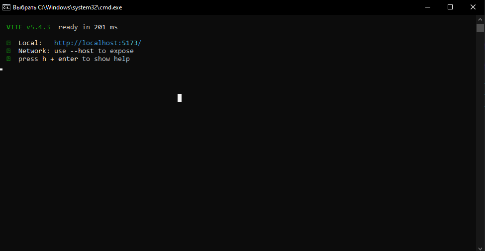

# Крестики Нолики СИИ 4 курс Дубна

## Запуск:

**_ВАЖНО_**
для запуска приложения на компьютере обязательно должен быть установлен **nodejs**

### Через консоль:

**в текущей директории поочередно прописать:**

1. npm i
2. npm run dev
3. Перейти по адресу http://localhost:5173/

### Через run.bat файл:

1. Дважды нажать на run.bat
2. Подождать пока установятся все зависимости
3. Если все удачно, то должно получится что-то типа такого:
   
   4.Перейти по адресу http://localhost:5173/
